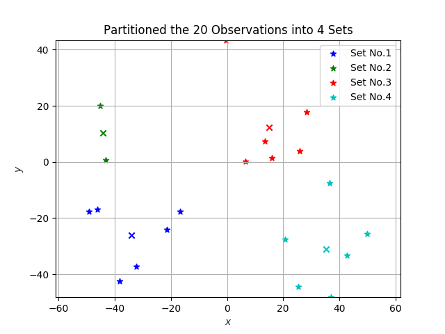

# CMeans - Improved K-Means Algorithm for the Capacitated Clustering Problem

## Example

In the following example:

* **Vector2** is a class representing a two dimensional vector.
* **frand** is a function returning a random number in the range [MIN, MAX].

```cpp
std::vector<Vector2> points;

for (std::size_t count = 0UL; count < NUMBER_OF_POINTS; count++)
    points.emplace_back(frand(MIN, MAX), frand(MIN, MAX));

auto cost = [](const Vector2& A, const Vector2& B)
{
    const double xdiff = A.x() - B.x();
    const double ydiff = A.y() - B.y();

    return xdiff * xdiff + ydiff * ydiff;
};

auto demand = [](const Vector2& v)
{
    return 1UL;
};

auto clusters = Cluster<Vector2>::cmeans(points, CAPACITY, cost, demand);
```

```bash
./bin/cmeans 20 6 -50 +50 | python3 plot.py -s ./data/tiny.png
```



```bash
./bin/cmeans 50 13 -50 +50 | python3 plot.py -s ./data/small.png
```


```bash
./bin/cmeans 130 27 -50 +50 | python3 plot.py -s ./data/medium.png
```


```bash
./bin/cmeans 250 53 -50 +50 | python3 plot.py -s ./data/large.png
```


```bash
./bin/cmeans 500 109 -50 +50 | python3 plot.py -s ./data/huge.png
```


## References

[Improved K-Means Algorithm for the Capacitated Clustering Problem](http://citeseerx.ist.psu.edu/viewdoc/download?doi=10.1.1.414.2123&rep=rep1&type=pdf)

