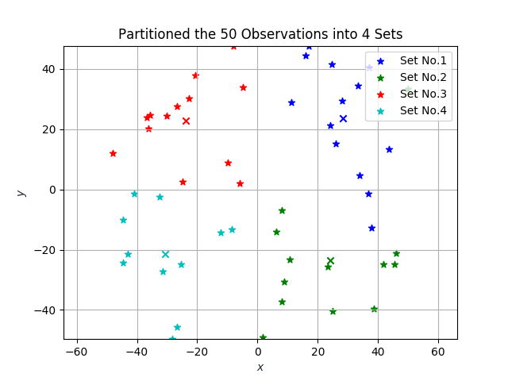
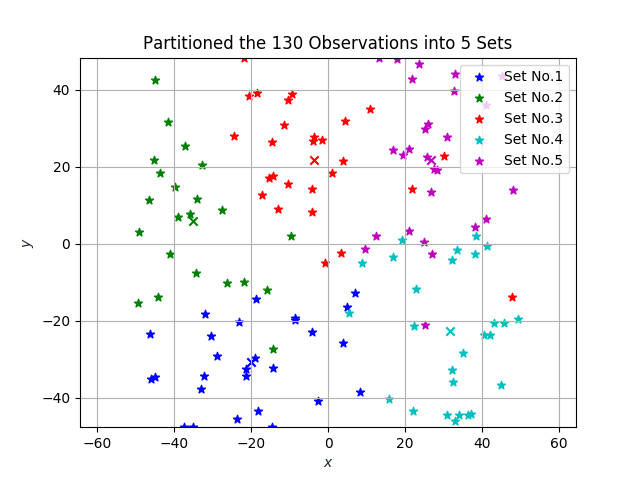
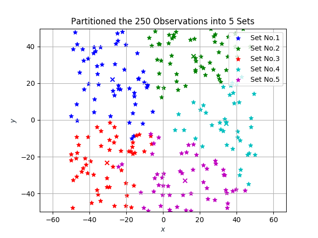
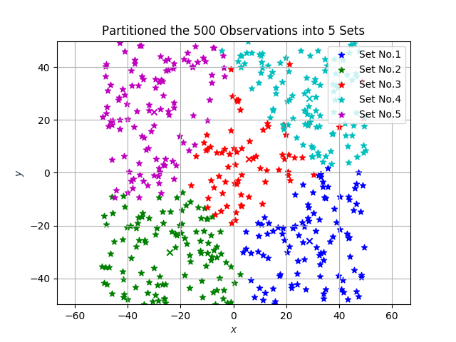

# cmeans

[](https://opensource.org/licenses/MIT)

## Example

Firstly, we need to define what we are going to be clustering. **Vector2** implements a two dimensional point.

```cpp
class Vector2
{
    double _x, _y;

public:

    Vector2();
    Vector2(double, double);
    Vector2(const Vector2&);
    Vector2(const Vector2&&) noexcept;

    // Access:
    double x() const { return _x; }
    double y() const { return _y; }

    // IO:
    friend std::ostream& operator<<(std::ostream&, const Vector2&);
    friend std::istream& operator>>(std::istream&, Vector2&);

    // Operations:
    Vector2& operator=(const Vector2&);
    Vector2& operator=(const Vector2&&);

    friend Vector2 operator+(const Vector2&, const Vector2&);
    friend Vector2 operator-(const Vector2&, const Vector2&);
    friend double  operator*(const Vector2&, const Vector2&);
    friend Vector2 operator*(const Vector2&, double);
    friend Vector2 operator/(const Vector2&, double);

    Vector2& operator+=(const Vector2&);
    Vector2& operator-=(const Vector2&);
    Vector2& operator*=(double);
    Vector2& operator/=(double);

    friend bool operator< (const Vector2&, const Vector2&);
    friend bool operator> (const Vector2&, const Vector2&);
    friend bool operator==(const Vector2&, const Vector2&);
    friend bool operator!=(const Vector2&, const Vector2&);
};
```

Let's now create some random points.

```cpp
auto frand = [](double min, double max)
{
    const double fraction = static_cast<double>(std::rand()) / static_cast<double>(RAND_MAX);

    return min + fraction * (max - min);
};

std::vector<Vector2> points;

for (std::size_t count = 0UL; count < NUMBER_OF_POINTS; count++)
    points.emplace_back(frand(MIN, MAX), frand(MIN, MAX));
```

Finally, let's partition them into distinct groups.

```cpp
auto cost = [](const Vector2& A, const Vector2& B)
{
    const double xdiff = A.x() - B.x();
    const double ydiff = A.y() - B.y();

    return xdiff * xdiff + ydiff * ydiff;
};

auto demand = [](const Vector2& v)
{
    return 1UL;
};

auto clusters = Cluster<Vector2>::cmeans(points, CAPACITY, cost, demand);
```

Accessing each cluster's internals can be achieved through the methods **centroid** and **elements**. In this example, we are using these methods in order to produce some output to pipe into our [visualization program](plot.py).

```cpp
for (const auto& cluster : clusters)
{
    std::string points;

    points += "(" + std::to_string(cluster.centroid().x());
    points += ", ";
    points += std::to_string(cluster.centroid().y()) + ")";

    for (const auto& element : cluster.elements())
    {
        points += ", ";
        points += "(" + std::to_string(element->x());
        points += ", ";
        points += std::to_string(element->y()) + ")";
    }

    std::cout << "[" + points + "]" << std::endl;
}
```

For further explanation on the **cost** and the **demand** arguements, check [this](http://citeseerx.ist.psu.edu/viewdoc/download?doi=10.1.1.414.2123&rep=rep1&type=pdf).

```bash
./bin/cmeans 20 6 -50 +50 | python3 plot.py -s ./data/tiny.png
```


```bash
./bin/cmeans 50 13 -50 +50 | python3 plot.py -s ./data/small.png
```



```bash
./bin/cmeans 130 27 -50 +50 | python3 plot.py -s ./data/medium.png
```



```bash
./bin/cmeans 250 53 -50 +50 | python3 plot.py -s ./data/large.png
```



```bash
./bin/cmeans 500 109 -50 +50 | python3 plot.py -s ./data/huge.png
```



## Acknowledgements

[Improved K-Means Algorithm for the Capacitated Clustering Problem](http://citeseerx.ist.psu.edu/viewdoc/download?doi=10.1.1.414.2123&rep=rep1&type=pdf)

